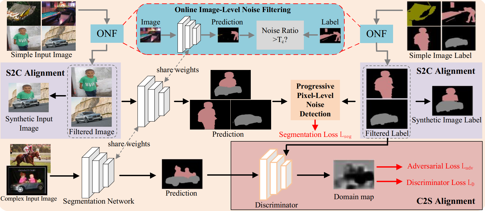

# Multi-Granularity Denoising and Bidirectional Alignment for Weakly Supervised Semantic Segmentation


Introduction
------------
This is the source code for our paper **Multi-Granularity Denoising and Bidirectional Alignment for Weakly Supervised Semantic Segmentation** 


Network Architecture
--------------------
The architecture of our proposed approach is as follows



## Installation

* Install PyTorch 1.6 with Python 3 and CUDA 10.1

* Clone this repo
```
git clone https://github.com/NUST-Machine-Intelligence-Laboratory/MDBA.git
```

### Download PASCAL VOC 2012 

* Download [PASCAL VOC 2012](http://host.robots.ox.ac.uk/pascal/VOC/voc2012/#devkit) and put it into ./dataset to obtain ./dataset/VOC2012

## Testing
* Download our trained model [VOC_69.5.pth](https://mdma.oss-cn-shanghai.aliyuncs.com/VOC_69.5.pth) and put it in the ./model folder

```
python evaluate.py --restore-from ./model/VOC_69.5.pth

python evaluate_crf.py 
```

## Training
* Download the [COCO pre-trained parameters](https://mdma.oss-cn-shanghai.aliyuncs.com/resnet101COCO-41f33a49.pth) and put it in the ./model folder

* Download saliency-generated pseudo labels [sal2gt](https://mdma.oss-cn-shanghai.aliyuncs.com/sal2gt.zip) and put it into ./dataset to obtain ./dataset/sal2gt. 


* Train the segmentation model  
```
python train.py  
```


## Testing two-step result
* Download our trained model [checkpoint_72.0.pth](https://mdma.oss-cn-shanghai.aliyuncs.com/checkpoint_72.0.pth) and put it in the ./step2/data/models folder

```
cd step2

python main.py test --config-path configs/voc12.yaml --model-path data/models/checkpoint_72.0.pth

python main.py crf --config-path configs/voc12.yaml
```

## Two-step training
* Generate pseudo labels from the segmentation network trained by our proposed approach. 
```
python gen_label.py --restore-from ./model/VOC_69.5.pth

python gen_label_crf.py 

python gen_label_mining.py
```

* Download the [COCO pre-trained parameters for two-step training](https://mdma.oss-cn-shanghai.aliyuncs.com/deeplabv1_resnet101-coco.pth)  and put it in the step2/data/models folder. Then train the segmentation model with pseudo labels . (You need to step2/libs/datasets/voc.py set the path for pseudo labels.)

```
python main.py train --config-path configs/voc12.yaml
```


